# VIVE Tracker using openvr 
Directly read orientation and position data from the VIVE Ultimate Tracker using Python.

# 1. Steam
推荐：`ubuntu 22.04`和`windows`，这里以`Ubuntu 22.04`为例

`ATTENTION`: 在ubuntu 20.04中，无法在后续步骤中打开`steamVR`进行配对(不支持图形化界面),所以在第一次使用时推荐`ubuntu 22.04`或`windows`系统，具体详见`steamVR`部分内容

## 1. update the software package first
```
sudo apt update
sudo apt upgrade
```
## 2. download steam


## 3. install steam
website: https://store.steampowered.com/about

可以在本代码仓中直接找到`steam.deb`文件并进行下载
```
sudo dpkg -i steam.deb
```
第一次点击`Start Steam`会进入安装终端，此时要分别按大概`3-4`次enter进行安装，安装好后会自动升级系统

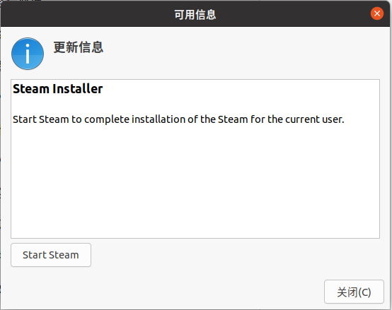
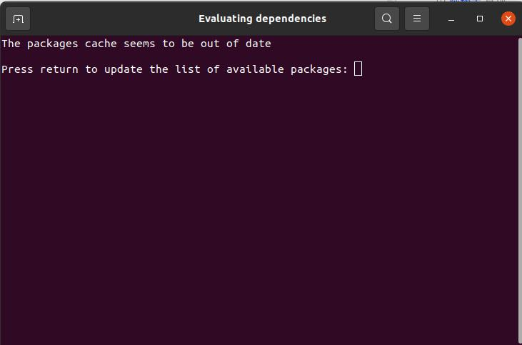
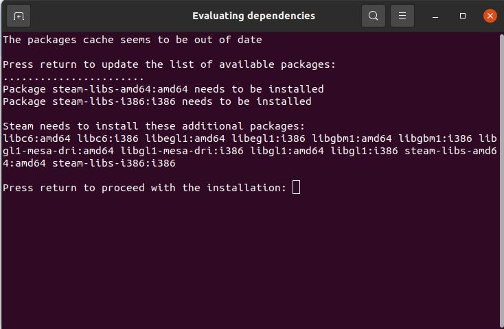
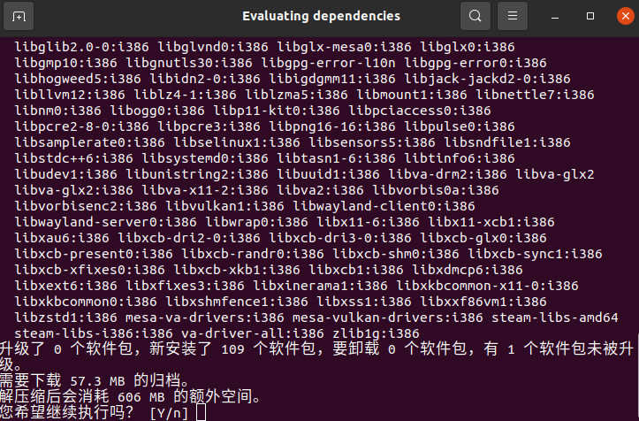

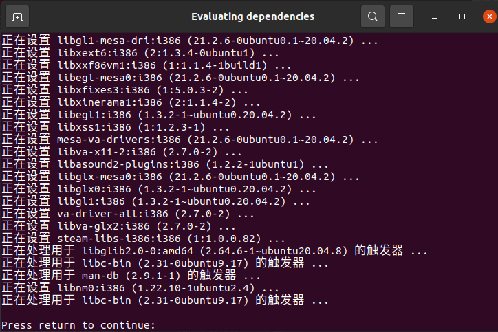
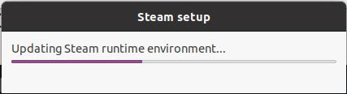
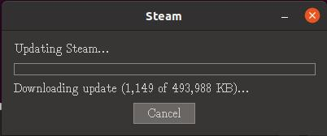
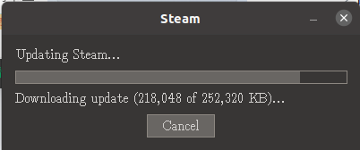
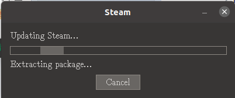

更新根据网络情况而定，推荐网络有线连接

## 2. bug

如果安装时出现下图报错，需要先补充安装curl。

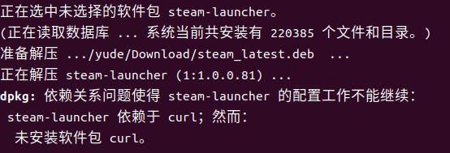

```
sudo apt install curl
```
启动Steam可能会出下如下报错。

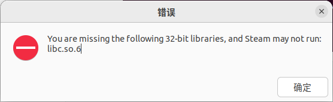

在启动`steam`时，请在自动打开的`terminal`中根据指引安装所需的`package`。

# 2. steamVR
推荐：`ubuntu 22.04`和`windows`，这里以`Ubuntu 22.04`为例
`ATTENTION`: 在`ubuntu 20.04`中，无法打开`steamVR`进行配对(不支持图形化界面),因此建议在第一次配对时使用`windows`或`ubuntu 22.04` 系统进行配对，而后再切入`ubuntu 20.04`系统进行使用。切入系统使用前仍然需要安装`steamVR`修改`config`文件，因为`openvr`的驱动依赖于`steamvr`,具体修改步骤详见下方内容

## 1. install steamVR
在仓库中搜索`steamvr`，安装`SteamVR`时也会自动安装 `Linux Runtime 3.0`。 
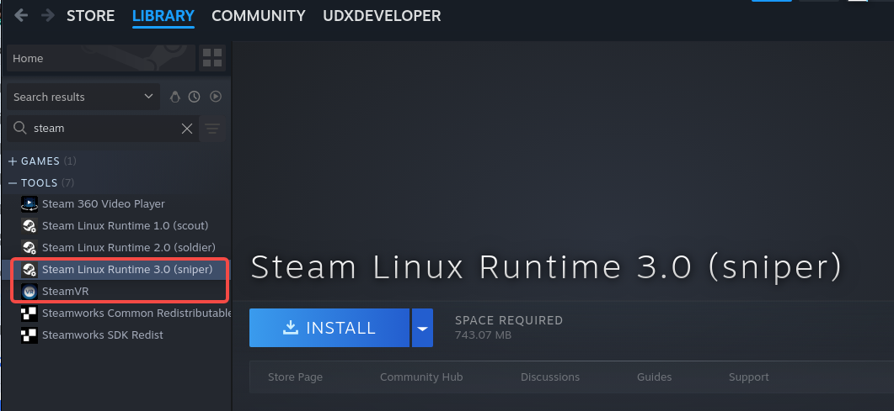
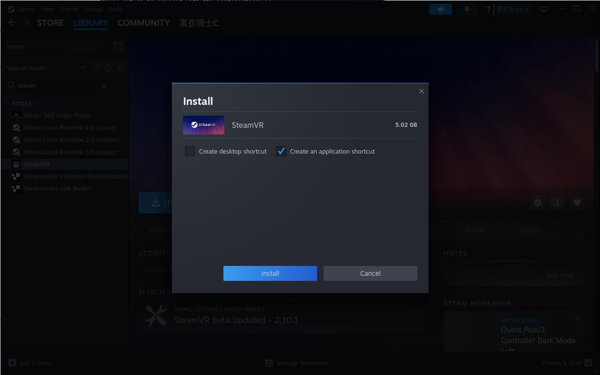
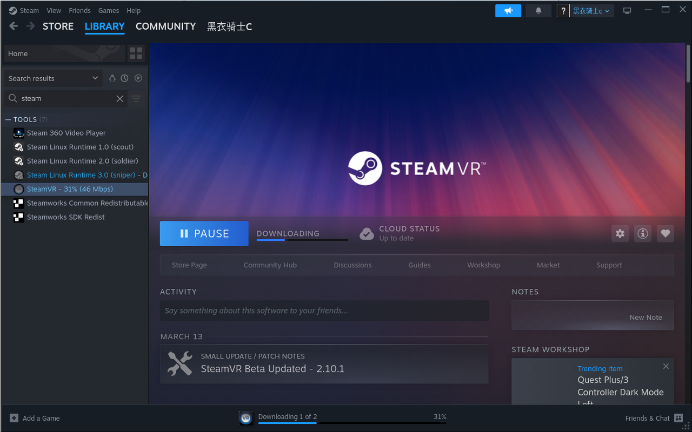
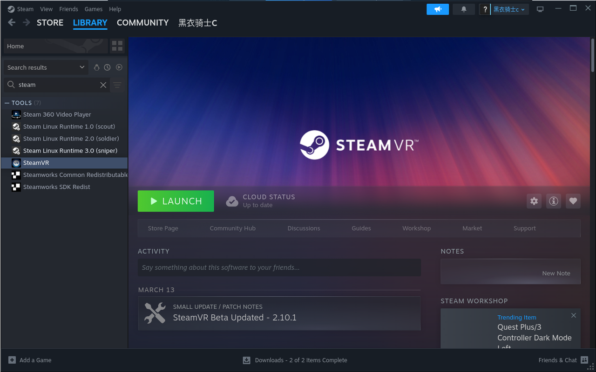

this step only occurs in `ubuntu` system

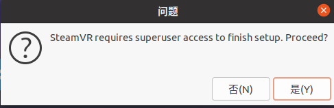

## 2. 连接定位器
### 第一次连接
需要按图所示连接

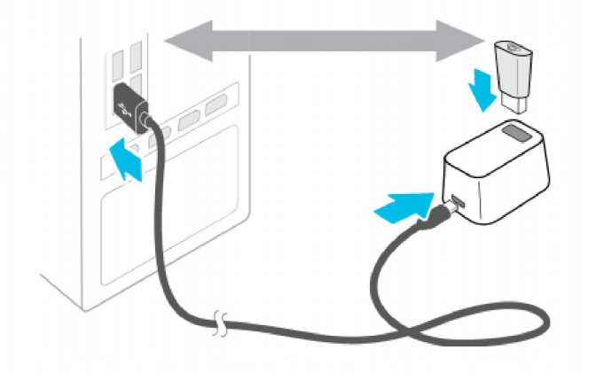
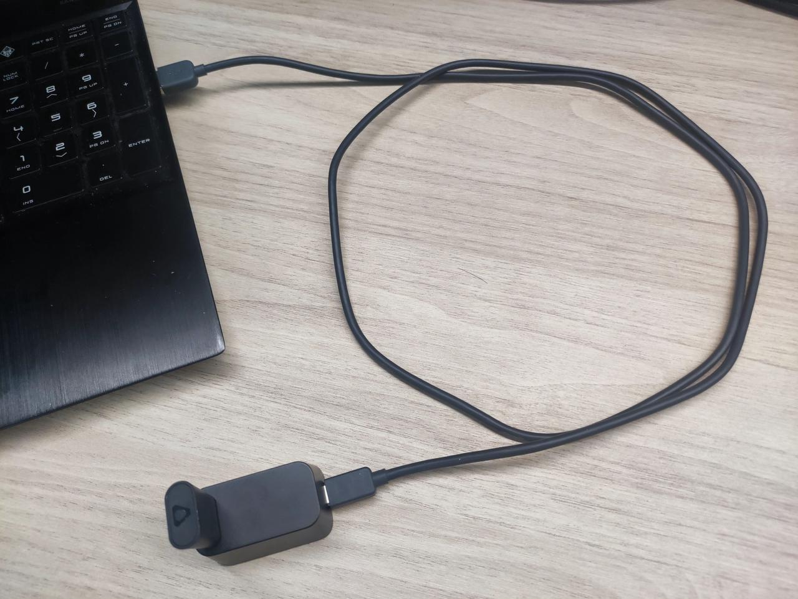

### 后续连接 

按图所示方式连接一次后则不需要，之后直接将蓝牙适配器拔下来插入`PC USB`口即可

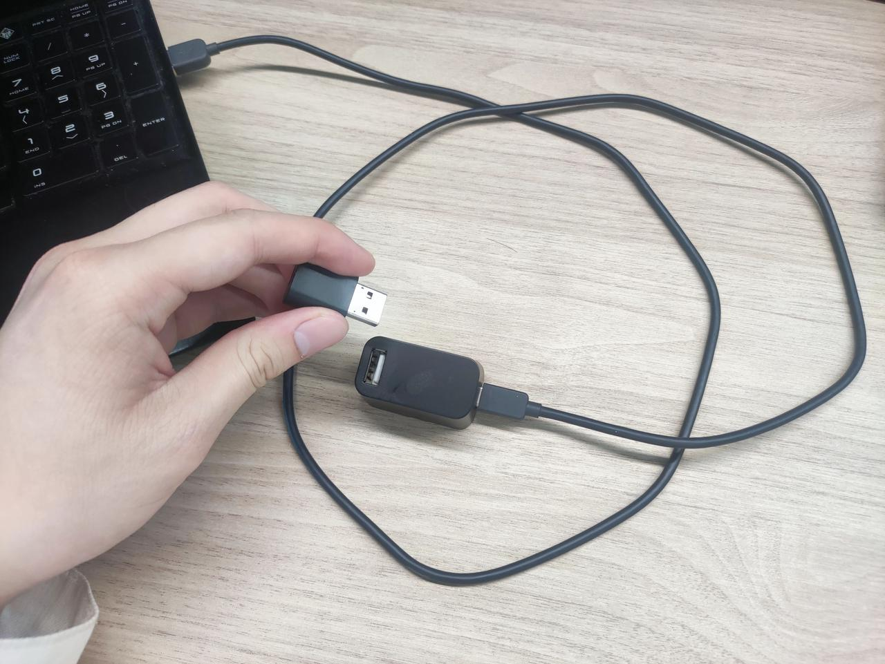
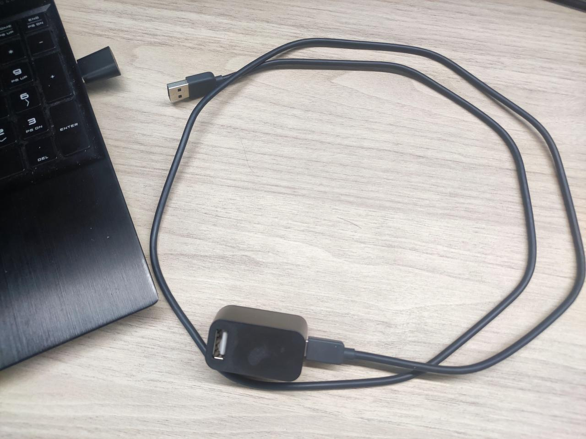

## 3. modify config
### ubuntu
#### enable driver
```
sudo vim ~/.steam/steam/steamapps/common/SteamVR/drivers/null/resources/settings/default.vrsettings
```
Open the null driver file and replace `"enable": false`, with `"enable": true`,
```
{
    "driver_null": {
        "enable": true,
        "loadPriority": -999,
        "serialNumber": "Null Serial Number",
        "modelNumber": "Null Model Number",
        "windowX": 0,
        "windowY": 0,
        "windowWidth": 2160,
        "windowHeight": 1200,
        "renderWidth": 1512,
        "renderHeight": 1680,
        "secondsFromVsyncToPhotons": 0.01111111,
        "displayFrequency": 90.0
    }
}
```
#### disable VR headset
```
sudo vim ~/.steam/steam/steamapps/common/SteamVR/resources/settings/default.vrsettings
```
#### Change 
1. `"requireHmd": true`, to `"requireHmd": false`,
2. `"forcedDriver": ""`, to `"forcedDriver": "null"`, 
3. `"activateMultipleDrivers": false`, to `"activateMultipleDrivers": true`,

after installing `steam` and `steamVR`

### windows
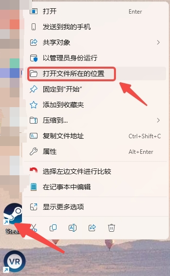
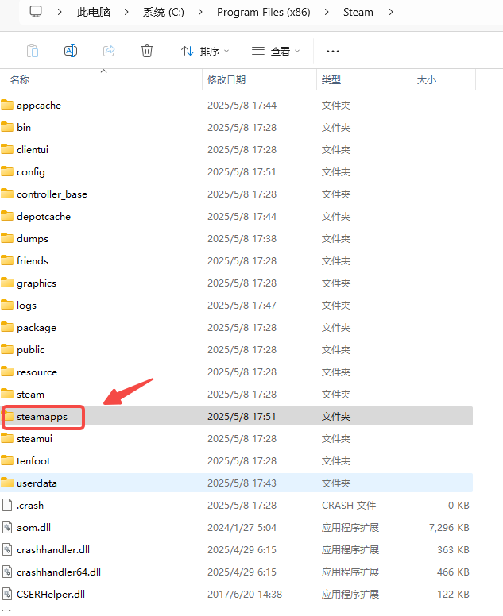

对比`ubuntu` 路径`steamapps/common/SteamVR/resources/settings/default.vrsettings`打开对应的文件，修改方式和上面`Ubuntu`一样

### start steamVR to pair trackers

启动`steamVR`，`steamVR`可以启动`VIVE`的驱动。确保`VR headset`, 定位器基站和`tracker`都连接

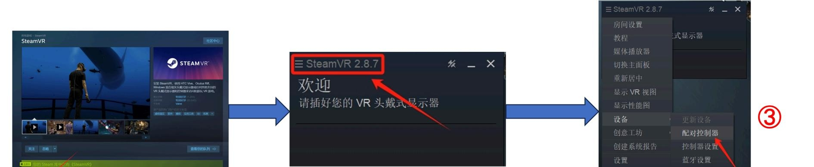
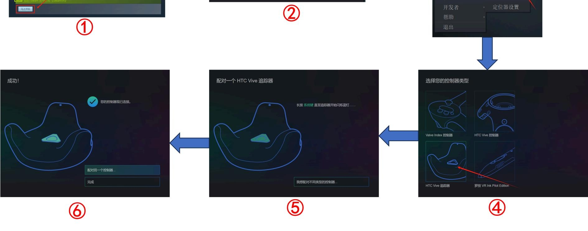

for **step 5**, you can see in 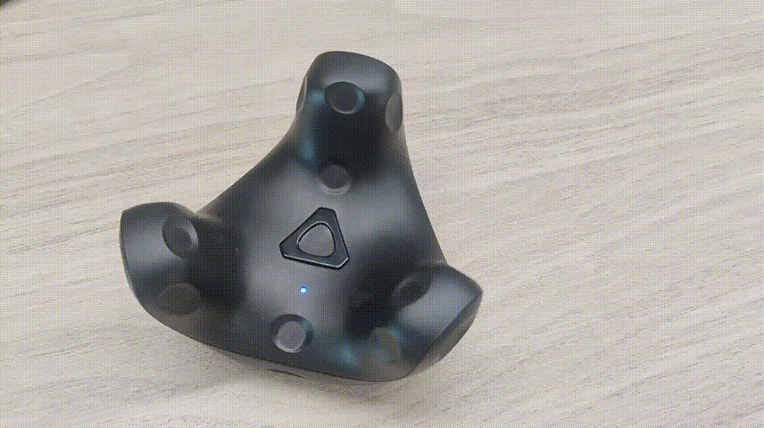

after pair successfully, it will show the picture below

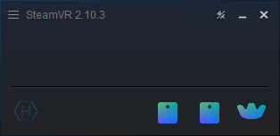

# environment requirement
## ubuntu
```sh
pip install openvr numpy matplotlib collections mpl_toolkits.mplot3d 
```
## windows
```sh
pip install openvr numpy matplotlib collections mpl_toolkits.mplot3d win_precise_time
```
# 3. coordinate system
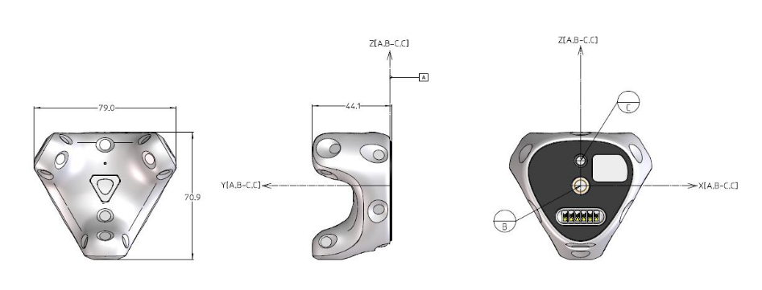

VIVE Tracker (3.0) uses the “Right-handed coordinate system”.
1. Datum A is set to be the top surface of the ring feature around the 1/4” Screw Nut.
> 基准面A：围绕 1/4 英寸螺纹螺母的环形特征上表面。
2. Datum B is set to be the intersection point between the centerline of Standard Camera Mount (1/4” Screw Bolt) and Datum A.
> 基准点B：标准相机支架（1/4 英寸螺钉）中心线与基准面A的交点。
3. Datum C is set to be the intersection point between the centerline of Stabilizing Pin Recess and Datum A.
> 基准点C：稳定销凹槽中心线与基准面A的交点。
4. The coordinate system is constructed by the Datum frame of Datum A, the line of Datum B and Datum C, and Datum C itself.
> 该坐标系由基准面A、基准点B与C的连线以及基准点C共同构建而成。

# 4. usage
### 1. read tracker 6 dof pose information
```python
python tracker.py
```
aftern running this program, if you want your tracking data to be:
- a. output `6 dof pose` to terminal
- b. live plotted in a `3D` plot (might impact system performance)
- c. live plotted in a `time/XYZ` plot
- d. saved in a `.csv` file  

output
```
Tracker 0: [-0.05243462324142456, -0.14969228208065033, -1.3739923238754272, 0.6392734003249869, 0.6136829491089955, 0.3124104099660625, -0.3422316009644308] 
Tracker 0: [-0.0515730194747448, -0.1505933701992035, -1.3816518783569336, 0.6393158619547124, 0.613702487691718, 0.3123262788311258, -0.34219402222760714] 
Tracker 0: [-0.05071805790066719, -0.15148380398750305, -1.3892226219177246, 0.639357912173423, 0.6137095767419568, 0.3122797935863463, -0.34214521644610874] 
```
### 2. calibrate the coordinate
```
python tracker_calib.py
```
启动之后，选定X和Z轴的方向，先沿着X轴方向做往返运动，而后根据程序输出再切回Y轴方向做往返运动
after executing this step, the program will save ``*npz`` file as a result of calibration
### 2. read 6 dof pose information of two trackers
```python
python two_tracker.py
```
